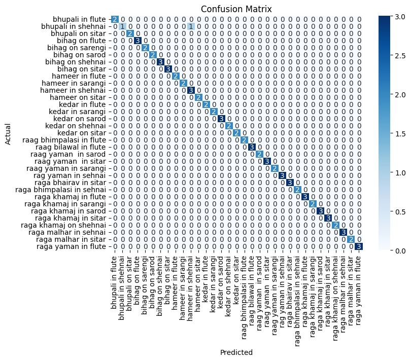

# 🎵 Hindustani Raga Classification using Machine Learning

This project classifies Indian classical ragas based on audio features extracted from sample data. Built entirely using Python in *Google Colab*, this ML model helps music learners and enthusiasts understand the root raga behind songs.

## 🔍 Features
- Multi-class classification of ragas
- Preprocessing and feature extraction from audio files
- Model training using Scikit-learn and/or TensorFlow
- Visualizations of audio patterns (spectrograms, waveforms)
- Evaluation using accuracy & confusion matrix

## 🧠 Technologies Used
- Python (Colab)
- NumPy, Pandas
- Librosa (audio processing)
- Scikit-learn
- Matplotlib, Seaborn

## 📁 Dataset
(Dataset is public)

- Source: [https://drive.google.com/drive/folders/1ihliCXGEMrvMsQQPeQSlGGI2-8J3dhAA?usp=drive_link]
- Preprocessed using MFCCs and spectral features

## ▶️ How to Run

You can run the notebook directly on Google Colab:

[](https://colab.research.google.com/github/Devsigner26/RagaClassificationUsingML/blob/main/raga_classifier.ipynb)

Or:

1. Clone this repo:
   ```bash
   git clone https://github.com/Devsigner26/RagaClassificationUsingML.git


## 📊 Results

- *Accuracy*: 98.75%
- *Precision / Recall / F1*: (0.99/ 0.98/ 0.99)
- *Confusion Matrix*:



> The model shows good separation between common ragas like Bhairav and Yaman. Future improvements can focus on rarer ragas with fewer data points.

## 🚀 Future Enhancements

- 🎶 Expand model to support *Carnatic* and *semi-classical* ragas
- 🌐 Deploy the classifier as a *web app* using *Streamlit* or *Flask*
- 📈 Improve model accuracy by using *deep learning* (e.g., CNNs for spectrograms)
- 🎵 Include *audio previews* of each predicted raga
- 🧠 Add *explainability* using SHAP or LIME for predictions

## 🙋‍♂️ Author

*Srinjoy Ghosh*  
- 💼 [LinkedIn](https://www.linkedin.com/in/srinjoyghosh26)  
- 💻 [GitHub](https://github.com/Devsigner26)  
- 📧 srinjoyghosh260203@gmail.com

## 📜 License

This project is licensed under the *MIT License* – see the [LICENSE](./LICENSE) file for details.
